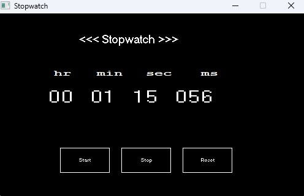

# ⏱️ C++ Graphics Stopwatch

A precise, real-time stopwatch application built with **C++** using the **Graphics.h (BGI)** library. It tracks time with millisecond accuracy using the modern `<chrono>` library.

## ✨ Features
- **High Precision:** Uses `std::chrono::steady_clock` for accurate time tracking.
- **Graphical Interface:** Simple and clean UI with buttons.
- **Interactive Controls:** Mouse-driven Start, Stop, and Reset functionality.
- **Detailed Display:** Shows time in Hours, Minutes, Seconds, and Milliseconds.

## 📸 Preview

## 🛠️ How it Works
1. **Time Logic:** The program captures the `startTime` when you click Start and calculates the `elapsed` duration continuously.
2. **Graphics Engine:** Uses coordinate-based detection for buttons and a `while` loop to refresh the display every 20ms.
3. **Event Handling:** Detects left mouse clicks (`WM_LBUTTONDOWN`) within specific button boundaries.

## 🚀 How to Run
1. Ensure you have the **Graphics.h (WinBGIm)** library configured in your IDE (Code::Blocks/Dev-C++).
2. Create a new C++ project.
3. Link the following libraries in your Linker settings:
   `-lbgi -lgdi32 -lcomdlg32 -luuid -loleaut32 -lole32`
4. Compile and Run!

## ⌨️ Controls
- **Start:** Begins or resumes time tracking.
- **Stop:** Pauses the timer.
- **Reset:** Clears the timer back to zero.
- **ESC Key:** Closes the application.
